# CIS560
CIS 560 Coursework

Implemented simple raytracer 
-Normal 
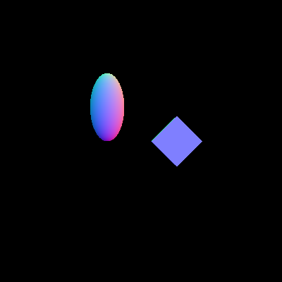</img>
</img>
</img> 
-Texture mapping, diffuse/reflective/refractive material 
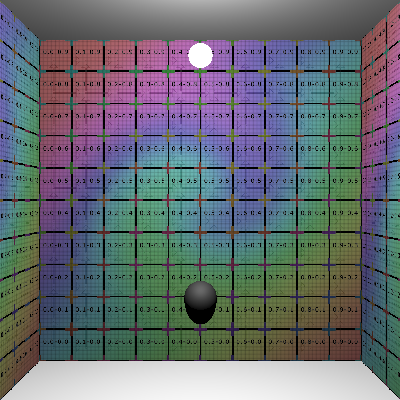</img>
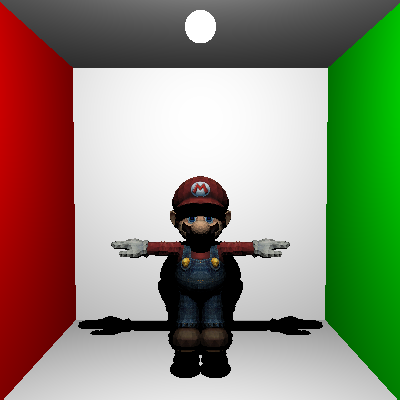</img>
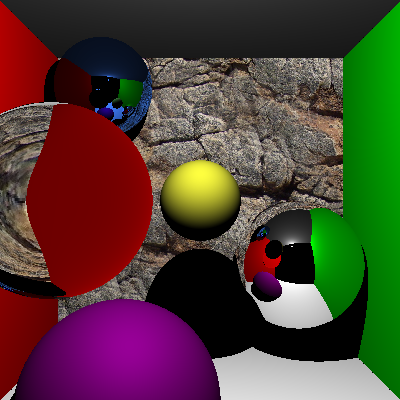</img> 
-Bounding Volumn Hierarchy 
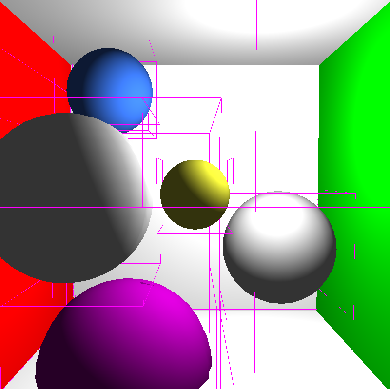</img>
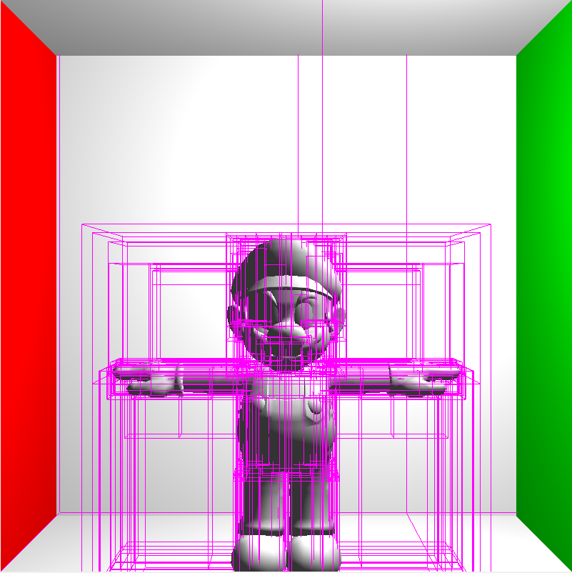</img> 
-Anti-aliasing 
</img>
</img>
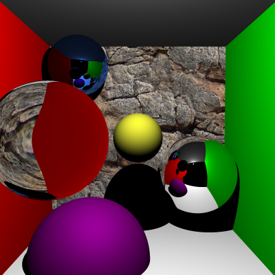</img> 
-Direct lighting with plane/mesh/textured lights 
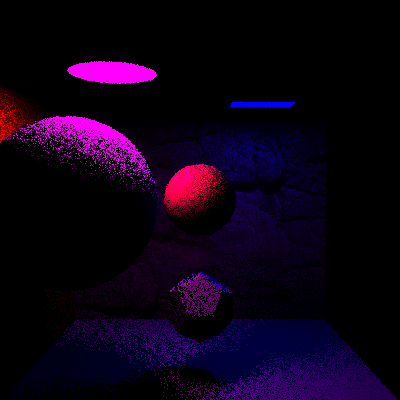</img>
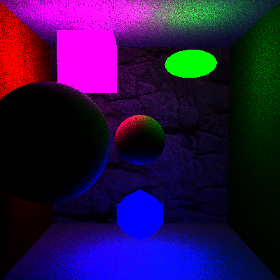</img>
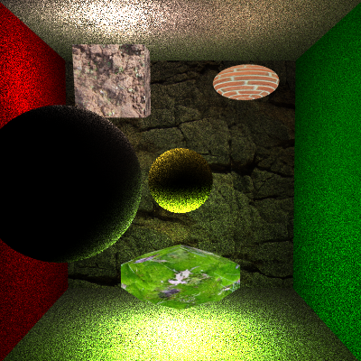</img> 
-Direct + Indirect lighting 
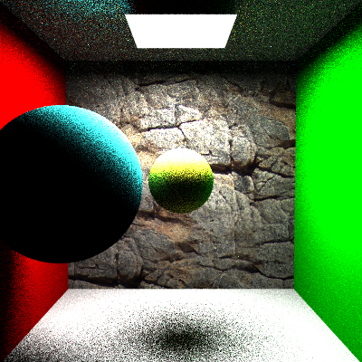</img> 
-Indirect lighting VS. Bidirectional lighting, depth of field 
</img>
</img>
</img> 
